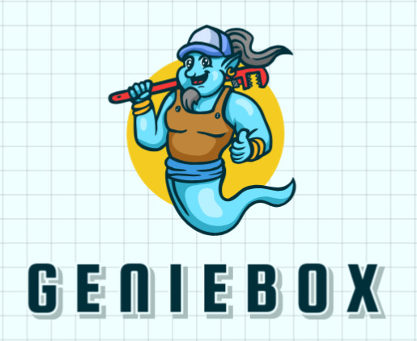

## Project Overview
This project is a React web application that consists of several features including user login, CSV combination, and a search functionality. The application is designed using TypeScript and integrates with Firebase for authentication.

### Project Structure
- **Pages Folder**: Contains the following components:
  - `login.tsx`: Handles user login functionality.
  - `index.tsx`: Entry point of the app that renders the initial view.
  - **Components Folder**: Contains reusable components:
    - `CombinedCsvAndSearchPage.tsx`: Manages the combination of CSV files and provides a search feature.
- **Public Folder**: Contains the following images:
  - Google logo (`0023352_sign-in-with-google-plugin_550.png`)
  - Geniebox image (`geniebox.jpg`)

### Features
- User login using Google authentication.
- CSV file upload and combination with an integrated search feature.
- Firebase integration for user authentication.

### Getting Started

#### Prerequisites
- Node.js (>=14.0)
- npm or yarn
- Firebase project credentials

#### Installation
1. Clone the repository:
   ```sh
   git clone <repository-url>
   cd <repository-directory>
   ```
2. Install dependencies:
   ```sh
   npm install
   ```

3. Configure Firebase:
   - Update `firebase.ts` with your Firebase project credentials.

#### Running the Project
- To start the development server, run:
  ```sh
  npm run dev
  ```
- Open the app at `http://localhost:3000`.


### Screenshots



---
